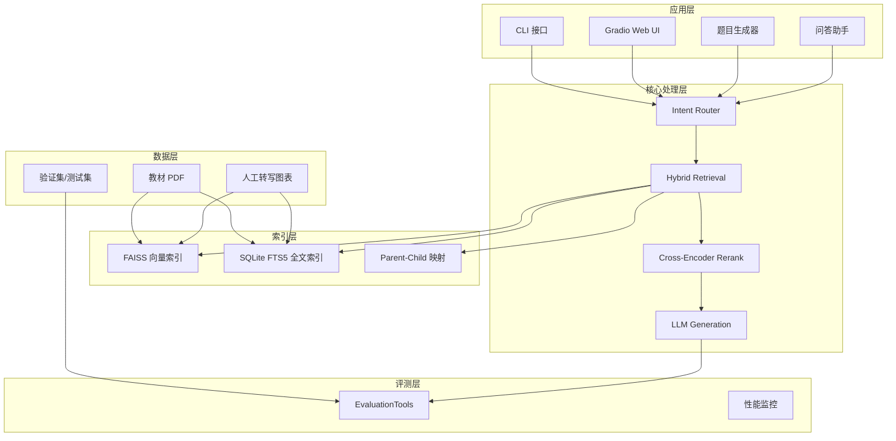
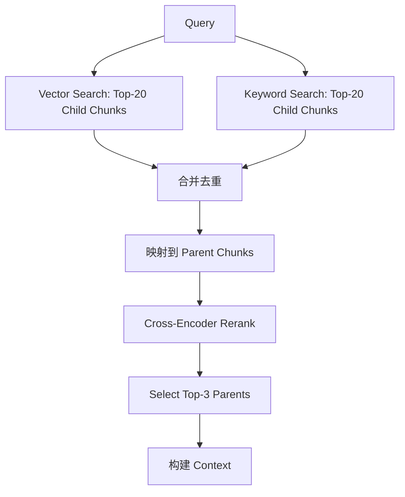
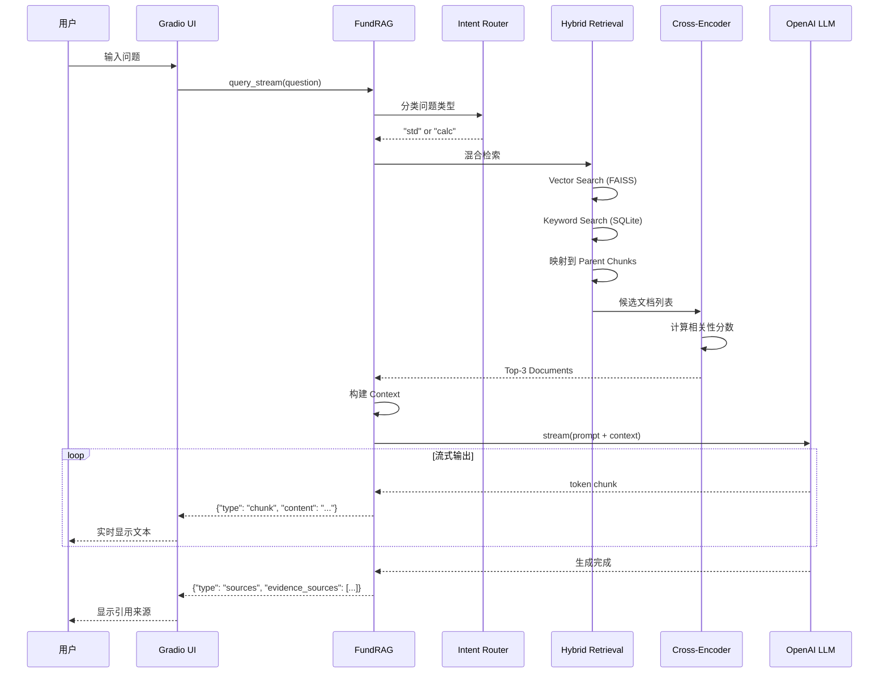
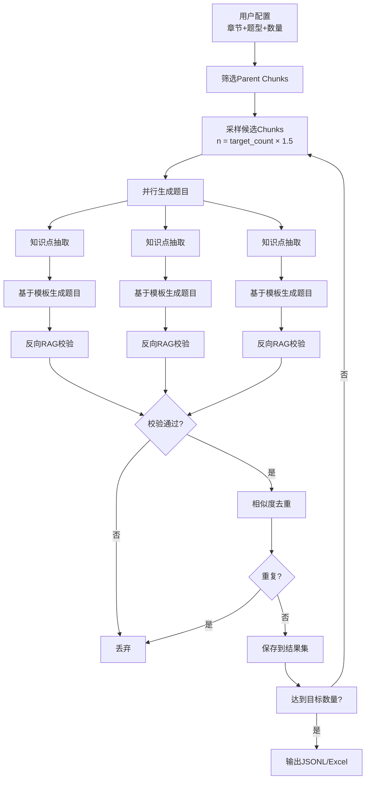

# 基金从业知识 Copilot 详细设计文档（Detailed Design Document）

**项目名称**: 基金从业知识 Copilot（基于 RAG 的考试型问答系统）  
**文档版本**: v1.0  
**最后更新**: 2026-01-12  
**系统版本**: V3 (Production)

---

## 目录

1. [项目概述](#1-项目概述)
2. [功能需求规格](#2-功能需求规格)
3. [系统架构设计](#3-系统架构设计)
4. [核心模块详细设计](#4-核心模块详细设计)
5. [用户界面设计](#5-用户界面设计)
6. [数据流与处理流程](#6-数据流与处理流程)
7. [数据库与存储设计](#7-数据库与存储设计)
8. [接口规范](#8-接口规范)
9. [异常处理与容错设计](#9-异常处理与容错设计)
10. [非功能性需求](#10-非功能性需求)
11. [测试策略](#11-测试策略)
12. [部署与运维](#12-部署与运维)
13. [附录](#13-附录)

---

## 1. 项目概述

### 1.1 项目背景

《证券投资基金》是基金从业人员资格考试与日常合规学习的核心教材。本项目通过 **RAG（Retrieval-Augmented Generation）** 技术，将教材内容转化为可检索、可解释、可评测的智能问答系统。

### 1.2 核心功能

- **智能问答**: 基于教材的考试型问答，支持流式输出
- **题目生成**: 自动生成高质量单选题，支持多种题型
- **引用溯源**: 显示答案来源的书籍、章节和置信度
- **多模式支持**: CLI、Web UI 两种交互方式

### 1.3 技术亮点

- **混合检索**: Vector (FAISS) + Keyword (SQLite FTS5)
- **智能重排**: Cross-Encoder Rerank (BGE)
- **意图路由**: 自动识别计算题与事实题
- **真实流式**: 直接从 LLM 流式获取响应
- **高准确率**: 全量测试准确率 XXXX

---

## 2. 功能需求规格

### 2.1 功能需求概述

本系统需满足以下核心功能需求：

| 需求ID | 功能名称 | 优先级 | 描述 |
|--------|---------|--------|------|
| FR-01 | 智能问答 | P0 | 基于教材内容回答基金从业考试相关问题 |
| FR-02 | 题目生成 | P1 | 自动生成高质量单选题用于学习测试 |
| FR-03 | 引用溯源 | P0 | 显示答案来源的书籍、章节和置信度 |
| FR-04 | 流式输出 | P1 | 实时流式显示答案生成过程 |
| FR-05 | 多模式交互 | P1 | 支持CLI和Web UI两种交互方式 |
| FR-06 | 意图识别 | P0 | 自动识别计算题和事实题并路由 |
| FR-07 | 批量评测 | P2 | 支持批量题目评测和准确率统计 |

### 2.2 详细功能规格

#### 2.2.1 智能问答 (FR-01)

**输入**:
- 用户问题（文本，1-2000字符）
- 可选：历史对话上下文

**处理流程**:
1. 问题预处理（去除无效字符、分词）
2. 意图分类（计算题/事实题/情景题）
3. 混合检索（向量+关键词）
4. 结果重排序
5. LLM生成答案
6. 引用来源提取

**输出**:
- 答案文本
- 引用来源列表（书籍、章节、置信度）
- 推理类型标识

**约束**:
- 答案必须基于检索到的教材内容
- 不得引入外部知识
- 若无足够依据，明确提示用户

#### 2.2.2 题目生成 (FR-02)

**输入**:
- 目标章节列表
- 题型选择（事实题/选非题/情景题）
- 生成数量（1-50题）

**处理流程**:
1. 筛选符合条件的Parent Chunks
2. 知识点结构化抽取
3. 基于模板生成题目
4. 反向RAG校验答案唯一性
5. 去重过滤（与验证集/已生成题目对比）

**输出**:
- 结构化题目列表（题干、选项、答案、解析）
- 来源元数据
- 校验置信度

**约束**:
- 每道题必须有且仅有一个正确答案
- 干扰项必须合理且互斥
- 生成题目不得与验证集重复（相似度<0.85）

#### 2.2.3 引用溯源 (FR-03)

**输入**:
- 检索到的文档列表
- Rerank分数

**输出格式**:
```
📚 引用来源:

[1] 证券投资基金·上册 | 第5章

Confidence: 0.89

Evidence:
> 开放式基金申购费率一般为0.6%-1.5%...
```

**约束**:
- 至少显示Top-3来源
- 置信度显示2位小数
- Evidence摘要不超过150字符

#### 2.2.4 流式输出 (FR-04)

**行为**:
- 用户提交问题后立即显示在界面
- 显示"正在检索..."和"正在生成答案..."状态
- 答案内容逐token实时显示
- 引用来源在答案完成后追加

**性能要求**:
- 首字延迟 < 3秒
- 更新频率：每2个chunk更新一次
- 界面无卡顿

### 2.3 用户角色与权限

| 角色 | 描述 | 权限 |
|-----|------|------|
| 普通用户 | 学习者、考生 | 问答查询、浏览题目 |
| 管理员 | 系统维护人员 | 所有功能 + 评测 + 配置管理 |

**注**: 当前版本暂不实现用户认证，所有功能对本地用户开放。

### 2.4 业务规则

1. **答案生成规则**:
   - 单选题必须返回选项字母（A/B/C/D）
   - 问答题返回简洁文本（200-500字）
   - 计算题必须展示推理步骤

2. **检索规则**:
   - 混合检索召回Top-20（向量10+关键词10）
   - 重排后选择Top-3~5作为上下文
   - 单个Parent Chunk长度800-1500字符

3. **题目生成规则**:
   - 每个Parent Chunk最多生成1题
   - 干扰项必须来自同章节或相近概念
   - 校验置信度 > 0.7 才入库

---

## 3. 系统架构设计

### 2.1 总体架构图



### 2.2 目录结构

```text
rag-fundtest/
├── rawdoc/                          # 原始数据（只读）
│   ├── 基金从业资格考试官方教材（上册）.pdf
│   ├── 基金从业资格考试官方教材（下册）.pdf
│   └── validation_set.xlsx          # 验证集
│
├── data/                            # 处理后的数据
│   ├── chunks.jsonl                 # 切分后的文本块
│   └── generated_questions_*.jsonl  # 生成的题目
│
├── index/                           # 检索索引
│   ├── faiss_v2/                    # FAISS 向量索引
│   │   ├── index.faiss
│   │   └── index.pkl
│   └── sqlite_v2.db                 # SQLite 全文索引
│
├── models/                          # 本地模型
│   └── bge-reranker-base/          # 重排模型
│
├── config/                          # 配置文件
│   └── prompt_templates.py         # Prompt 模板
│
├── ui/                             # 用户界面
│   ├── app.py                      # Gradio 主应用
│   ├── components.py               # 题目生成器组件
│   ├── callbacks.py                # 题目生成器回调
│   ├── chat_components.py          # 问答助手组件
│   ├── chat_callbacks.py           # 问答助手回调
│   └── chat_utils.py               # 工具函数
│
├── scripts/                        # 脚本工具
│   ├── generate_questions.py      # 题目生成管道
│   └── analyze_*.py                # 分析脚本
│
├── rag_pipeline_v3.py              # RAG 核心管道
├── cli.py                          # CLI 接口
├── EvaluationTools.py              # 评测工具
├── requirements.txt                # 依赖清单
└── .env                            # 环境变量（不入库）
```

---

## 4. 核心模块详细设计

### 3.1 数据处理层

#### 3.1.1 PDF 解析与切分

**策略**:
- 使用 `pdfplumber` 提取正文文本
- 按章节标题进行层级切分
- 图表内容采用人工结构化转写

**Chunk 切分规则**:
- **Child Chunk** (用于检索):
  - 长度: 200-400 字符
  - Overlap: 50-80 字符
  - 用途: 提高检索精度
  
- **Parent Chunk** (用于生成):
  - 长度: 800-1500 字符
  - 包含完整语义单元
  - 用途: 提供完整上下文给 LLM

**元数据结构**:
```python
{
    "chunk_id": "uuid",
    "parent_id": "uuid",
    "book": "证券投资基金·上册",
    "chapter": "第2章 基金概述",
    "section": "2.1 基金的分类",
    "chunk_type": "text" | "table_rewrite",
    "content": "...",
    "child_content": "..."  # 仅 parent chunk 包含
}
```

#### 3.1.2 人工转写图表

**转写规范**:
- 每条转写包含精确位置信息
- 标注为高优先级知识片段
- 条目化、顺序化表达

**示例**:
```
【原图表】: 表2-1 开放式基金与封闭式基金的对比

【转写内容】:
开放式基金与封闭式基金的主要区别：
1. 份额变动：开放式可变，封闭式固定
2. 交易场所：开放式向基金公司申赎，封闭式在交易所交易
3. 价格形成：开放式按净值，封闭式由市场决定
...
```

### 3.2 检索索引层

#### 3.2.1 FAISS 向量索引

**配置**:
- 向量库: FAISS (本地)
- Embedding 模型: OpenAI text-embedding-3-small
- 相似度度量: Cosine Similarity
- 索引类型: IndexFlatIP (内积)

**索引构建**:
```python
import faiss
from langchain_community.vectorstores import FAISS

# 对 child chunks 建立向量索引
vectorstore = FAISS.from_documents(
    documents=child_chunks,
    embedding=OpenAIEmbeddings(model="text-embedding-3-small")
)
```

#### 3.2.2 SQLite FTS5 全文索引

**表结构**:
```sql
CREATE VIRTUAL TABLE docs_fts USING fts5(
    content,              -- child chunk 内容
    book,
    chapter,
    section,
    chunk_id UNINDEXED,   -- 用于关联，但不参与全文检索
    parent_id UNINDEXED
);
```

**查询示例**:
```sql
-- 支持中文分词和短语匹配
SELECT chunk_id, parent_id, rank
FROM docs_fts
WHERE docs_fts MATCH '申购 AND 费率'
ORDER BY rank
LIMIT 20;
```

### 3.3 RAG 核心管道（rag_pipeline_v3.py）

#### 3.3.1 FundRAG 类架构

```python
class FundRAG:
    def __init__(self):
        # 1. 加载索引
        self.faiss_index = FAISS.load_local(...)
        self.sqlite_conn = sqlite3.connect(...)
        
        # 2. 初始化 LLM
        self.std_llm = ChatOpenAI(model="qwen-max")  # 标准问题
        self.calc_llm = ChatOpenAI(model="gpt-5-mini")  # 计算问题
        
        # 3. 延迟加载 Reranker
        self._reranker = None
    
    def _classify_query(self, question: str) -> str:
        """意图识别：'calc' 或 'std'"""
        pass
    
    def hybrid_retrieval(self, question: str, final_k=5) -> List[Dict]:
        """混合检索 + 重排"""
        pass
    
    def query(self, question: str) -> Dict:
        """同步查询（完整返回）"""
        pass
    
    def query_stream(self, question: str):
        """流式查询（逐 token 返回）"""
        pass
```

**FundRAG 提供两类 API，适用于不同场景**：

| API | 返回方式 | 使用场景 | 调用模块 | 优点 | 缺点 |
|-----|---------|---------|---------|------|------|
| `query()` | 阻塞式，完整返回 | 批量评测、脚本调用 | CLI、EvaluationTools | 简单直接，适合批处理 | 等待时间长，无实时反馈 |
| `query_stream()` | 流式，逐token生成 | 交互式问答 | Web UI (Gradio) | 实时反馈，用户体验好 | 实现复杂，需异步处理 |

**返回格式对比**：

```python
# query() - 返回完整结果字典
result = rag.query("什么是开放式基金？")
# 返回: {
#     "full_response": "开放式基金是指...",
#     "evidence_sources": [...],
#     "retrieved_docs": [...]
# }

# query_stream() - 逐步yield流式块
for chunk in rag.query_stream("什么是开放式基金？"):
    chunk_type = chunk.get("type")
    if chunk_type == "metadata":
        # {"type": "metadata", "docs_found": 5}
    elif chunk_type == "chunk":
        # {"type": "chunk", "content": "开放式"}
    elif chunk_type == "sources":
        # {"type": "sources", "evidence_sources": [...], "retrieved_docs": [...]}
```

#### 3.3.2 混合检索流程



**代码实现**:
```python
def hybrid_retrieval(self, question: str, final_k=5):
    # 1. 向量检索（召回 child chunks）
    vector_results = self.faiss_index.similarity_search(
        question, k=20
    )
    
    # 2. 关键词检索（召回 child chunks）
    keyword_results = self._sqlite_search(question, k=20)
    
    # 3. 合并去重
    all_child_ids = set([r.metadata['chunk_id'] for r in vector_results + keyword_results])
    
    # 4. 映射到 parent chunks
    parent_chunks = self._map_to_parents(all_child_ids)
    
    # 5. Rerank（对 parent chunks 重新排序）
    reranked = self._rerank(question, parent_chunks)
    
    # 6. 返回 Top-K
    return reranked[:final_k]
```

#### 3.3.3 Cross-Encoder Rerank

**模型**: BAAI/bge-reranker-base  
**输入**: `(query, parent_content)` 对  
**输出**: 相关性分数（0-1）

```python
def _rerank(self, question: str, chunks: List[Dict]) -> List[Dict]:
    if not self._reranker:
        from sentence_transformers import CrossEncoder
        self._reranker = CrossEncoder('models/bge-reranker-base')
    
    # 构造 (query, doc) 对
    pairs = [[question, chunk['content']] for chunk in chunks]
    
    # 批量打分
    scores = self._reranker.predict(pairs)
    
    # 添加分数并排序
    for chunk, score in zip(chunks, scores):
        chunk['rerank_score'] = float(score)
    
    return sorted(chunks, key=lambda x: x['rerank_score'], reverse=True)
```

#### 3.3.4 LLM 生成（流式输出）

**关键创新**: 直接从 LLM 流式获取响应

```python
def query_stream(self, question: str):
    """
    真实流式输出：直接从 LLM 获取 token
    
    Yields:
        dict: {"type": "metadata"|"chunk"|"sources", ...}
    """
    # 1. 意图识别
    pipeline_type = self._classify_query(question)
    
    # 2. 检索
    final_docs = self.hybrid_retrieval(question, final_k=5)
    
    yield {"type": "metadata", "docs_found": len(final_docs)}
    
    # 3. 构建上下文
    context_str = self.format_context(final_docs)
    
    # 4. 选择 Chain
    chain = self.calc_chain if pipeline_type == 'calc' else self.std_chain
    
    # 5. 流式生成（关键：使用 .stream()）
    for chunk in chain.stream({
        "context": context_str,
        "question": question
    }):
        yield {"type": "chunk", "content": chunk}
    
    # 6. 返回引用来源
    yield {
        "type": "sources",
        "evidence_sources": [d['metadata'] for d in final_docs],
        "retrieved_docs": final_docs
    }
```

**Prompt 模板** (标准问题):
```python
RAG_QA_PROMPT_TEMPLATE = """
你是一个基金从业资格考试的专业问答助手。

【上下文】（来自教材）
{context}

【问题】
{question}

【回答要求】
1. 仅基于上述上下文作答
2. 若上下文中没有明确答案，回复"教材中未找到明确依据"
3. 对于单选题，只回答选项字母（A/B/C/D）
4. 对于问答题，简洁清晰地回答

【答案】
"""
```

---

## 5. 用户界面设计

### 4.1 UI 架构（Gradio）

系统提供双模式 Web UI：
1. **题目生成器模式** (Question Generator)
2. **问答助手模式** (Chat Assistant)

通过右上角按钮切换。

### 4.2 问答助手 UI 设计

#### 4.2.1 页面布局

```
┌────────────────────────────────────────────────────┐
│  📚 Knowledge-driven Question Generator            │
│  Fund Certification Exam Prep Copilot  [🤖 问答助手]│
├────────────────────────────────────────────────────┤
│  ### 🤖 知识问答助手                                │
│  输入您的问题，获取基于教材的专业解答              │
├────────────────────────────────────────────────────┤
│  💬 对话历史                                        │
│  ┌──────────────────────────────────────────────┐  │
│  │  👤 用户: 开放式基金的申购费率是多少？        │  │
│  │                                                │  │
│  │  🤖 助手: 根据教材内容，开放式基金的申购...   │  │
│  │                                                │  │
│  │  ───────────────────────────────────────────  │  │
│  │  📚 引用来源:                                  │  │
│  │  [1] 证券投资基金·上册 | 第5章               │  │
│  │  Confidence: 0.89                              │  │
│  │  Evidence:                                     │  │
│  │  > 开放式基金申购费率一般为0.6%-1.5%...        │  │
│  └──────────────────────────────────────────────┘  │
│                                                     │
│  ┌──────────────────────────────────────────────┐  │
│  │ 请输入您的问题...                    [🚀 发送]│  │
│  └──────────────────────────────────────────────┘  │
└────────────────────────────────────────────────────┘
```

#### 4.2.2 核心组件（chat_components.py）

```python
def create_chat_ui_components():
    components = {}
    
    # 对话历史显示
    components['chat_display'] = gr.Chatbot(
        label="💬 对话历史",
        height=320,  # 适配一屏显示
        show_label=True,
        avatar_images=(None, None)
    )
    
    # 用户输入框
    components['user_input'] = gr.Textbox(
        placeholder="请输入您的问题...",
        lines=2,
        max_lines=4
    )
    
    # 发送按钮
    components['send_btn'] = gr.Button(
        "🚀 发送问题",
        variant="primary",
        size="sm"
    )
    
    return components
```

#### 4.2.3 流式输出实现（chat_callbacks.py）

```python
def on_send_message(user_message: str, chat_history: List[Dict]):
    """
    真正的流式输出实现
    """
    # 1. 立即显示用户消息
    chat_history.append({"role": "user", "content": user_message})
    yield chat_history, ""
    
    # 2. 显示状态提示
    chat_history.append({"role": "assistant", "content": "🤖 正在检索..."})
    yield chat_history, ""
    
    chat_history[-1] = {"role": "assistant", "content": "🤖 正在生成答案..."}
    yield chat_history, ""
    
    # 3. 流式获取 LLM 响应
    rag = get_rag()
    accumulated_text = ""
    chunk_count = 0
    
    for stream_chunk in rag.query_stream(user_message):
        if stream_chunk["type"] == "chunk":
            accumulated_text += stream_chunk["content"]
            chunk_count += 1
            
            # 每2个 chunk 更新一次，避免更新过频
            if chunk_count % 2 == 0:
                chat_history[-1] = {
                    "role": "assistant",
                    "content": accumulated_text
                }
                yield chat_history, ""
        
        elif stream_chunk["type"] == "sources":
            evidence_sources = stream_chunk["evidence_sources"]
            retrieved_docs = stream_chunk["retrieved_docs"]
    
    # 4. 添加引用来源
    sources_text = format_sources(evidence_sources, retrieved_docs)
    if sources_text:
        complete_response = accumulated_text + sources_text
        chat_history[-1] = {"role": "assistant", "content": complete_response}
        yield chat_history, ""
```

#### 4.2.4 引用来源格式化（chat_utils.py）

```python
def format_sources(metadata_list: List[Dict], retrieved_docs: List[Dict]) -> str:
    """
    格式化引用来源，包含：
    - 书籍和章节信息
    - 置信度分数
    - 文本摘要
    """
    if not metadata_list:
        return ""
    
    sources_md = "\n\n---\n\n📚 **引用来源**:\n\n"
    
    for i, (meta, doc) in enumerate(zip(metadata_list, retrieved_docs), 1):
        book = meta.get('book', 'Unknown')
        chapter = meta.get('chapter', 'Unknown')
        rerank_score = doc.get('rerank_score', 0.0)
        
        snippet = doc['content'][:150] + "..."
        
        # 使用 HTML 标签优化样式
        sources_md += f"**[{i}]** {book} | {chapter}\n\n"
        sources_md += f"<b>Confidence:</b> {rerank_score:.2f}\n\n"
        sources_md += f"<b>Evidence:</b>\n"
        sources_md += f"<span style='font-size: 0.9em; color: #666;'>> {snippet}</span>\n\n"
    
    return sources_md
```

### 5.3 题目生成器 UI 设计

详见 `scripts/generate_questions.py` 中的 `QuestionGenerationPipeline`。

**主要功能**:
- 按章节筛选
- 题型选择（Fact / Negative / Scenario）
- 批量生成（支持并发）
- 结果导出（JSONL / Excel）

**组件列表**:
| 组件 | 类型 | 功能 |
|-----|------|------|
| chapter_selector | CheckboxGroup | 多选章节 |
| question_type_selector | CheckboxGroup | 选择题型 |
| count_slider | Slider | 设置生成数量（1-50） |
| generate_btn | Button | 启动生成流程 |
| progress_text | Textbox | 显示进度状态 |
| result_table | Dataframe | 展示生成结果 |
| download_jsonl | File | 下载JSONL格式 |
| download_excel | File | 下载Excel格式 |

---

## 6. 数据流与处理流程

### 6.1 问答处理完整流程



### 6.2 题目生成处理流程



### 6.3 关键时序说明

| 阶段 | 耗时 | 说明 |
|-----|------|------|
| 意图识别 | 0.01s | 基于规则的本地判断 |
| 向量检索 | 0.18s | FAISS召回Top-20 |
| 关键词检索 | 0.12s | SQLite FTS5召回Top-20 |
| 映射Parent | 0.05s | 查询SQLite映射表 |
| 重排序 | 0.32s | BGE Cross-Encoder |
| 上下文构建 | 0.01s | 字符串拼接 |
| LLM生成 | 8-15s | OpenAI API调用（含网络） |
| **总耗时** | **~15s** | 端到端平均 |

### 6.4 数据流图（高层视图）

```
用户问题
    ↓
[意图路由] → 计算题/事实题标记
    ↓
[混合检索]
    ├── Vector Search (FAISS) → 20个child chunks
    └── Keyword Search (SQLite) → 20个child chunks
    ↓
[合并去重] → 映射到Parent Chunks
    ↓
[Cross-Encoder Rerank] → Top-3 Parents
    ↓
[Context构建] → 拼接检索文档
    ↓
[LLM生成]
    ├── 标准Pipeline (Qwen-max)
    └── 计算Pipeline (GPT-5-mini + CoT)
    ↓
[流式输出] → 逐token返回
    ↓
[引用来源] → 附加Confidence和Evidence
    ↓
用户界面显示
```

---

## 7. 数据库与存储设计

### 6.1 向量索引存储 (FAISS)

**存储位置**: `index/faiss_v2/`

**索引类型**: IndexFlatIP (内积索引)

**数据结构**:
```python
{
    "vectors": np.ndarray,  # shape: (N, 1536)
    "metadata": List[Dict]  # chunk元数据
}
```

**持久化**:
- `index.faiss`: 向量索引文件
- `index.pkl`: 元数据pickle文件

### 7.2 全文索引存储 (SQLite FTS5)

**数据库文件**: `index/sqlite_v2.db`

**表结构**:

```sql
-- Child Chunks 全文索引表
CREATE VIRTUAL TABLE docs_fts USING fts5(
    content TEXT,           -- child chunk 内容
    book TEXT,              -- 书籍名称
    chapter TEXT,           -- 章节
    section TEXT,           -- 小节
    chunk_id TEXT UNINDEXED,-- child chunk ID
    parent_id TEXT UNINDEXED-- 对应的 parent chunk ID
);

-- Parent-Child 映射表
CREATE TABLE chunk_mapping (
    child_id TEXT PRIMARY KEY,
    parent_id TEXT NOT NULL,
    parent_content TEXT NOT NULL,
    metadata TEXT NOT NULL  -- JSON格式
);

-- 索引
CREATE INDEX idx_parent_id ON chunk_mapping(parent_id);
```

**查询优化**:
- 使用FTS5内置的BM25排序
- 支持中文分词（jieba）
- 短语匹配优先级高于单词匹配

### 7.3 题目存储

**格式**: JSONL (每行一个JSON对象)

**文件路径**: `data/generated_questions_YYYYMMDD_HHMMSS.jsonl`

**数据结构**: 见附录8.3.2

### 7.4 配置存储

**文件**: `.env`

**内容**:
- API密钥（加密存储，不入版本库）
- 模型配置
- 索引路径

**安全措施**:
- `.env` 添加到 `.gitignore`
- 提供 `env.template` 模板文件
- 启动时检查必需配置项

---

## 8. 接口规范

### 8.1 核心类接口

#### 8.1.1 FundRAG 类

```python
class FundRAG:
    """RAG核心管道类"""
    
    def __init__(self):
        """初始化索引、LLM、Reranker"""
        pass
    
    def query(self, question: str) -> Dict:
        """
        同步查询（完整返回）
        
        Args:
            question: 用户问题
            
        Returns:
            {
                "full_response": str,
                "evidence_sources": List[Dict],
                "pipeline": "std" | "calc",
                "retrieved_docs": List[Dict]
            }
        """
        pass
    
    def query_stream(self, question: str) -> Generator[Dict]:
        """
        流式查询（逐chunk返回）
        
        Args:
            question: 用户问题
            
        Yields:
            {"type": "metadata", "docs_found": int} |
            {"type": "chunk", "content": str} |
            {"type": "sources", "evidence_sources": [...], ...}
        """
        pass
    
    def hybrid_retrieval(self, question: str, final_k: int = 5) -> List[Dict]:
        """
        混合检索
        
        Args:
            question: 查询问题
            final_k: 返回文档数量
            
        Returns:
            List[{
                "content": str,
                "metadata": {...},
                "rerank_score": float
            }]
        """
        pass
```

**API 使用场景详解**：

| 使用场景 | 推荐API | 调用示例 | 原因 |
|---------|--------|---------|------|
| **Web UI 交互式问答** | `query_stream()` | `ui/chat_callbacks.py` | 需要实时反馈，提升用户体验 |
| **CLI 单次问答** | `query()` | `cli.py` | 简单直接，适合命令行输出 |
| **批量评测** | `query()` | `EvaluationTools.py` | 需要完整结果进行准确率统计 |
| **脚本自动化** | `query()` | 自定义脚本 | 阻塞式更易于错误处理 |

**性能对比**：
- **首字延迟**: `query_stream()` < 3s, `query()` 需等待完整生成
- **总耗时**: 相同（均需完整LLM生成）
- **内存占用**: `query_stream()` 更低（无需缓存完整响应）

#### 8.1.2 QuestionGenerator 类

```python
class QuestionGenerator:
    """题目生成器类"""
    
    def generate_from_chapters(
        self,
        chapters: List[str],
        question_types: List[str],
        target_count: int
    ) -> List[Dict]:
        """
        按章节生成题目
        
        Args:
            chapters: 章节列表
            question_types: 题型列表 ["Fact", "Negative", "Scenario"]
            target_count: 目标生成数量
            
        Returns:
            List[生成的题目对象]
        """
        pass
    
    def verify_question(self, question: Dict) -> Tuple[bool, float]:
        """
        反向RAG校验题目
        
        Args:
            question: 题目对象
            
        Returns:
            (是否通过, 置信度分数)
        """
        pass
```

### 8.2 REST API 规范（未来扩展）

**基础URL**: `http://localhost:8000/api/v1`

#### 8.2.1 问答接口

```
POST /query
Content-Type: application/json

Request:
{
    "question": "开放式基金的申购费率是多少？",
    "stream": false
}

Response:
{
    "answer": "...",
    "sources": [...],
    "confidence": 0.89,
    "pipeline": "std"
}
```

#### 8.2.2 流式问答接口

```
POST /query/stream
Content-Type: application/json
Accept: text/event-stream

Request:
{
    "question": "..."
}

Response: (SSE格式)
data: {"type": "metadata", "docs_found": 5}

data: {"type": "chunk", "content": "根据"}

data: {"type": "chunk", "content": "教材"}

data: {"type": "sources", ...}
```

### 8.3 CLI 接口

```bash
# 单次问答
python cli.py --question "..."

# 交互模式
python cli.py --interactive

# 批量评测
python EvaluationTools.py --input validation_set.xlsx --output results.xlsx
```

---

## 9. 异常处理与容错设计

### 9.1 异常分类与处理策略

| 异常类型 | 触发条件 | 处理策略 | 用户提示 |
|---------|---------|---------|---------|
| **检索失败** | 无检索结果 | 返回友好提示 | "未在教材中找到相关信息，请尝试换个问法" |
| **检索冲突** | 多个矛盾依据 | 返回所有依据供用户判断 | "教材中有多种相关说法，请参考..." |
| **LLM调用失败** | API超时/限流 | 重试3次，指数退避 | "系统繁忙，请稍后重试" |
| **Rerank失败** | 模型加载错误 | 降级到原始检索排序 | 静默处理，记录日志 |
| **无效输入** | 空输入/超长输入 | 前端验证 + 后端拒绝 | "输入不能为空" / "输入过长（超过2000字）" |
| **文件不存在** | 索引文件缺失 | 启动时检查，提示重建 | "索引文件缺失，请运行初始化脚本" |

### 9.2 重试机制

```python
@retry(
    stop=stop_after_attempt(3),
    wait=wait_exponential(multiplier=1, min=4, max=10),
    retry=retry_if_exception_type(openai.APIError)
)
def call_llm_with_retry(prompt: str) -> str:
    """LLM调用带重试"""
    pass
```

### 9.3 降级策略

```
┌─────────────────┐
│ 正常流程         │
│ Vector + Keyword │
│    + Rerank      │
└────────┬─────────┘
         │ Rerank失败
         ↓
┌─────────────────┐
│ 降级流程         │
│ Vector + Keyword │
│ (无Rerank)       │
└────────┬─────────┘
         │ Vector失败
         ↓
┌─────────────────┐
│ 最小化流程       │
│ 仅Keyword检索   │
└─────────────────┘
```

---

## 10. 非功能性需求

### 10.1 性能需求

| 指标 | 目标值 | 度量方法 |
|-----|--------|---------|
| 单次问答响应时间 | < 20秒 | P95延迟 |
| 首字延迟（流式） | < 3秒 | 用户提交到首次显示 |
| 检索召回时间 | < 1秒 | 混合检索耗时 |
| 并发用户数 | 10+ | 单机支持 |
| 题目生成速度 | 10题/分钟 | 批量生成平均速度 |

### 10.2 可用性需求

### 10.3 可扩展性需求

- 支持新增教材章节（重建索引）
- 支持切换LLM模型（通过配置）
- 支持新增题型（扩展模板）

### 10.4 安全性需求


### 10.5 可维护性需求

- 模块化设计，低耦合
- 配置外部化（通过.env管理）

### 10.6 兼容性需求

- Python版本: 3.10+
- 操作系统: Windows / macOS / Linux
- 浏览器: Chrome 90+, Firefox 90+, Edge 90+

---

## 12. 部署与运维

### 11.1 部署架构

```
┌─────────────────────────────────────┐
│         用户浏览器                   │
│   http://127.0.0.1:7860              │
└─────────────┬───────────────────────┘
              │
              ↓
┌─────────────────────────────────────┐
│    Gradio Web Server (Python)       │
│    - 问答助手                        │
│    - 题目生成器                      │
└─────────────┬───────────────────────┘
              │
              ↓
┌─────────────────────────────────────┐
│    FundRAG Core Pipeline            │
│    - Hybrid Retrieval               │
│    - Cross-Encoder Rerank           │
│    - LLM Generation                 │
└──┬──────────────────────────────┬───┘
   │                              │
   ↓                              ↓
┌──────────┐              ┌──────────────┐
│ 本地索引  │              │ 远程 LLM API │
│ FAISS +  │              │ OpenAI /     │
│ SQLite   │              │ EFundGPT     │
└──────────┘              └──────────────┘
```

### 12.2 部署步骤

#### 步骤1: 环境准备

**环境要求**:

```text
Python: 3.10+
操作系统: Windows / macOS / Linux
内存: 8GB+
磁盘: 10GB+（含模型和索引）
```

#### 步骤2: 依赖安装

```bash
# 1. 创建虚拟环境
python -m venv .venv
source .venv/bin/activate  # Windows: .venv\Scripts\activate

# 2. 安装依赖
pip install -r requirements.txt
```

#### 步骤3: 环境变量配置（.env）

```bash
# OpenAI API（用于 Embedding 和 LLM）
OPENAI_API_KEY=sk-xxx
OPENAI_API_BASE=https://api.openai.com/v1

# EFundGPT API（可选，内部 LLM）
EFUNDS_API_KEY=xxx
EFUNDS_API_BASE=https://aigc.efunds.com.cn/v1
EFUNDS_ACC_TOKEN=xxx
EFUNDS_SOURCE=xxx

# 模型配置
RAG_LLM_MODEL=qwen-max        # 标准问题用模型
CALC_MODEL_NAME=gpt-5-mini    # 计算问题用模型
```

#### 步骤4: 索引验证

```bash
# 检查索引文件是否存在
ls -lh index/faiss_v2/
ls -lh index/sqlite_v2.db
```

#### 步骤5: 启动服务

**CLI 模式**:

```bash
python cli.py
```

**Web UI 模式**:

```bash
python -m ui.app
# 访问: http://127.0.0.1:7860
```

**评测模式**:

```bash
python EvaluationTools.py
```

## 13. 附录

### 13.1 关键文件清单

#### 核心模块

| 文件 | 功能 |
|-----|------|
| `rag_pipeline_v3.py` | RAG 核心管道（检索+生成+流式） |
| `cli.py` | 命令行交互接口 |
| `EvaluationTools.py` | 批量评测工具 |

#### UI 模块

| 文件 | 功能 |
|-----|------|
| `ui/app.py` | Gradio 主应用入口 |
| `ui/components.py` | 题目生成器 UI 组件 |
| `ui/callbacks.py` | 题目生成器回调函数 |
| `ui/chat_components.py` | 问答助手 UI 组件 |
| `ui/chat_callbacks.py` | 问答助手回调函数（含流式） |
| `ui/chat_utils.py` | 工具函数（RAG 实例、格式化） |

#### 配置与脚本

| 文件 | 功能 |
|-----|------|
| `config/prompt_templates.py` | Prompt 模板定义 |
| `scripts/generate_questions.py` | 题目生成管道 |
| `scripts/analyze_*.py` | 结果分析脚本 |

### 13.2 Prompt 模板示例

#### 13.2.1 标准问答 Prompt

```python
RAG_QA_PROMPT_TEMPLATE = """
你是一个基金从业资格考试的专业问答助手。

【上下文】（来自教材）
{context}

【问题】
{question}

【回答要求】
1. 仅基于上述上下文作答，不得引入外部知识
2. 若上下文中没有明确答案，回复"教材中未找到明确依据"
3. 对于单选题，只回答选项字母（A/B/C/D），并简要说明理由
4. 对于问答题，简洁清晰地回答，使用教材原文表述

【答案】
"""
```

#### 13.2.2 计算题 Prompt（CoT）

```python
CALC_QA_PROMPT_TEMPLATE = """
你是一个基金从业资格考试的专业问答助手，擅长处理计算题。

【上下文】（来自教材）
{context}

【问题】
{question}

【作答步骤】（请按以下步骤思考）
Step 1: 识别题目要求计算的目标（如：收益率、费率、金额等）
Step 2: 从上下文中提取相关公式或计算规则
Step 3: 识别题目中给出的已知条件和数据
Step 4: 逐步进行计算推理（展示计算过程）
Step 5: 得出最终答案，并与选项对比

【重要提醒】
- 必须使用教材中的公式和规则
- 计算过程要清晰、逻辑严密
- 若上下文中没有足够信息，明确说明

【答案】
"""
```

### 13.3 数据格式规范

#### 13.3.1 Chunk 数据格式

```json
{
  "chunk_id": "uuid-xxx",
  "parent_id": "uuid-yyy",
  "content": "开放式基金的申购费率通常在0.6%-1.5%之间...",
  "child_content": "申购费率 0.6%-1.5%",
  "metadata": {
    "book": "证券投资基金·上册",
    "chapter": "第5章 基金的费用",
    "section": "5.1 申购与赎回费用",
    "chunk_type": "text",
    "page": 231
  }
}
```

#### 13.3.2 生成题目格式

```json
{
  "id": "uuid-xxx",
  "question": "关于开放式基金的申购费率，以下说法正确的是：",
  "options": {
    "A": "申购费率通常在0.6%-1.5%之间",
    "B": "申购费率固定为1.0%",
    "C": "申购费率不得超过3%",
    "D": "申购费率由投资者自行协商"
  },
  "answer": "A",
  "explanation": "根据教材第5章，开放式基金申购费率通常在0.6%-1.5%之间。",
  "source_chunk_id": "uuid-yyy",
  "source_metadata": {
    "book": "证券投资基金·上册",
    "chapter": "第5章",
    "section": "5.1"
  },
  "question_type": "Fact",
  "verification_score": 0.92,
  "status": "Verified"
}

### 13.5 版本演进历史


### 13.6 术语表

| 术语 | 全称/解释 |
|-----|----------|
| RAG | Retrieval-Augmented Generation（检索增强生成） |
| FAISS | Facebook AI Similarity Search（向量相似度搜索库） |
| FTS5 | Full-Text Search 5（SQLite全文检索引擎） |
| BGE | BAAI General Embedding（智源通用嵌入模型） |
| CoT | Chain-of-Thought（思维链提示技术） |
| Parent-Child | 父子切片索引策略 |
| Rerank | 重排序（使用Cross-Encoder对候选文档重新打分） |
| BM25 | Best Matching 25（经典TF-IDF改进算法） |

### 13.7 未来优化方向

1. **性能优化**
   - 引入结果缓存（Redis）
   - 支持批量并发处理
   - 优化索引加载速度

2. **功能增强**
   - 多轮对话上下文理解
   - 答案收藏与导出
   - 学习进度跟踪

3. **模型优化**
   - 微调专用 Embedding 模型
   - 尝试开源 LLM（如 Qwen-14B）
   - 优化 Prompt 工程

### 13.8 参考文献

---

**文档维护**: 本文档将随系统迭代持续更新  
**文档版本**: v1.0  
**最后更新**: 2026-01-12  

