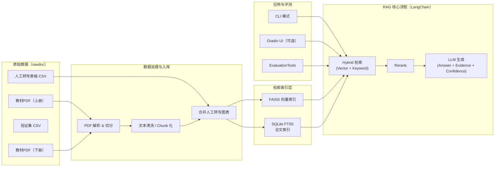

# 软件设计说明书（SDD）

## 项目名称
基金从业知识 Copilot（基于 RAG 的考试型问答系统）

---

## 1. 引言

### 1.1 项目背景
《证券投资基金》是基金从业人员资格考试与日常合规学习的核心教材，内容体系化、章节清晰，但篇幅较长、图表较多，不利于快速检索与高效复习。本项目旨在构建一个**基金从业知识 Copilot**，通过 **RAG（Retrieval-Augmented Generation）** 技术，将教材内容转化为可检索、可解释、可评测的智能问答系统，为考试与业务学习提供辅助。

### 1.2 设计目标
- 支持基于教材的**考试型问答（以单选题为主）**
- 提供**可溯源引用**与**置信度输出**
- 在有限算力与 API 额度下，实现**稳定、可控、可解释**的 RAG 系统

### 1.3 技术选型原则
- 轻量化、易部署（个人笔记本可运行）
- 贴合考试场景（关键词 + 精准定位）
- 避免过度工程设计

---

## 2. 总体架构设计

### 2.1 系统总体架构

系统采用轻量级分层架构，围绕“考试型 RAG”场景设计，核心由 **数据处理、混合检索、生成推理、评测与交互** 四部分组成。

（在正式文档或答辩 PPT 中，**强烈建议配套一张系统架构图或数据流图**，用于说明数据从原始教材到答案生成的完整路径。具体建议见第 2.3 节。）

---

### 2.2 项目目录结构设计

为保证工程清晰性、可维护性与可复现性，本项目采用如下目录结构：

```text
project_root/
├── rawdoc/                     # 原始数据（只读，不做修改）
│   ├── 基金从业资格考试官方教材（证券投资基金上册）.pdf
│   ├── 基金从业资格考试官方教材（证券投资基金下册）.pdf
│   ├── validation.csv           # 验证集（题目 + 标准答案）
│   └── table_explain.csv        # 人工转写图表（含位置字段）
│
├── data/                        # 清洗后的中间数据
│   ├── chunks.jsonl             # 切分后的文本 chunk（含 metadata）
│   └── docs_for_index.jsonl     # 用于索引构建的标准化文档
│
├── index/                       # 检索索引
│   ├── faiss/                   # FAISS 向量索引
│   └── sqlite_fts.db             # SQLite FTS5 全文索引文件
│
├── rag_pipeline.py              # RAG 核心流程（检索 + 重排 + 生成）
├── cli.py                       # CLI 交互入口
├── EvaluationTools.py           # 自动评测工具
│
├── config/
│   └── prompt_templates.py      # Prompt 模板定义
│
├── .env                         # 环境变量（API Key 等，不入库）
├── requirements.txt             # Python 依赖
└── README.md                    # 项目说明与运行方式


#### 2.3.1 系统架构图


展示模块划分与技术选型关系：



#### 2.3.2 数据流图

用于说明一次问答或一次评测的执行流程，例如：

```text
Question
  → Hybrid Retrieval (FAISS + FTS5)
      → Candidate Chunks
          → Rerank
              → LLM Answer
                  → Answer + Evidence + Confidence
```

---
## 3. 数据处理层设计

### 3.1 数据来源
- 教材 PDF：
  - 《证券投资基金（上册）》
  - 《证券投资基金（下册）》
- 验证集：基金从业资格考试试题（xlsx，含题目与答案）
- 测试集：仅包含题目（xlsx）

### 3.2 PDF 解析策略

#### 3.2.1 文本内容
- 使用 `pdfplumber / pypdf` 提取正文文本
- 依据章节标题进行层级切分

#### 3.2.2 图表内容处理策略

由于教材中包含大量流程图与对比表，且考试重点考察**制度性条款、流程逻辑和职责划分**，本项目采用如下策略：

- **不进行 OCR 或图像理解**
- 对高频考点对应的图表内容进行**人工结构化转写**
- 将图表信息转化为条目化、顺序化文本

#### 3.2.3 人工转写图表规范

每条人工转写内容均包含以下结构化位置信息：

- `book`：上册 / 下册
- `chapter`：章节名称（如：第2章 基金概述）
- `section`：小节名称
- `figure_ref`：图表编号与名称

并标注为高优先级知识片段。

### 3.3 Chunk 切分规则

- 普通正文 chunk：
  - 长度：300–800 中文字符
  - Overlap：80–120 字
- 图表转写 chunk：
  - 单独成块
  - 不与正文混合

---

## 4. 检索索引层设计（Hybrid Retrieval）

本项目采用 **向量检索 + 全文检索** 的混合检索架构。

### 4.1 向量检索（Vector Retrieval）

#### 4.1.1 技术选型
- 向量库：**FAISS**（本地）
- 相似度度量：Cosine Similarity

#### 4.1.2 向量数据
- 输入：chunk 正文文本
- 元数据：
  - book / chapter / section / figure_ref
  - chunk_type（正文 / manual_table_rewrite）
  - exam_priority

#### 4.1.3 设计理由
- 数据规模中小（几千至一万级 chunk）
- 无分布式与实时更新需求
- 本地可运行、成本低

---

### 4.2 全文检索（Keyword Retrieval）

#### 4.2.1 技术选型
- **SQLite FTS5**（全文检索虚拟表）

#### 4.2.2 索引设计

创建 FTS5 表，用于全文关键词匹配：

- `content`：chunk 正文
- `book`
- `chapter`
- `section`
- `figure_ref`

示意结构：

```sql
CREATE VIRTUAL TABLE docs_fts USING fts5(
  content,
  book,
  chapter,
  section,
  figure_ref
);
```

#### 4.2.3 设计理由

- 相比 ElasticSearch，SQLite FTS5：
  - 无需服务部署
  - 单文件数据库
  - 依赖极低
- 对考试题中的**关键词、数字、条件、术语**匹配效果稳定
- 与 FAISS 形成天然互补

---

### 4.3 Hybrid 检索流程

1. 用户输入问题
2. FAISS 向量召回 Top-K（语义相似）
3. SQLite FTS5 关键词召回 Top-K（精确匹配）
4. 合并、去重候选 chunk
5. 进入重排阶段

---

## 5. 生成与编排层设计

### 5.1 框架选型
- **LangChain**

### 5.2 选型理由

- 本项目为单向、同步 RAG Pipeline
- 不涉及多 Agent 协作或复杂状态机
- LangChain 抽象层级适中、可读性高

### 5.3 重排（Rerank）策略

- 基于 LLM 的轻量级 rerank
- 优先规则：
  - 来源章节匹配
  - 图表转写 chunk 优先（manual_table_rewrite）

---

## 6. 回答生成设计

### 6.1 Prompt 约束原则

- 仅基于检索到的证据作答
- 不允许引入外部知识
- 证据不足时明确提示

### 6.2 输出结构

- `Answer`：选项（A/B/C/D）
- `Evidence`：
  - book
  - chapter
  - section
  - figure_ref（如有）
- `Confidence`：0–1

---

## 7. 评测与验证设计

### 7.1 对比实验方案

| 实验组 | 说明 |
|---|---|
| Baseline | LLM-only（无检索） |
| Vector RAG | FAISS 向量检索 |
| Keyword RAG | SQLite FTS5 |
| Hybrid RAG | FAISS + FTS5 |

### 7.2 评测指标

- 单选准确率（Accuracy）
- Evidence Hit Rate（Top-K 命中）
- 图表题 vs 正文题准确率对比

---

## 8. 应用层设计（CLI + 可选 UI）

### 8.1 CLI 模式设计（必选）

系统提供轻量级命令行（CLI）交互模式，用于快速测试、调试与批量评测前的人工验证。

#### 8.1.1 CLI 功能
- 支持单条题目输入
- 调用 Hybrid RAG 流程生成答案
- 输出结构化结果：答案 / 置信度 / 引文来源

#### 8.1.2 CLI 交互示例
```text
$ python cli.py
请输入题目（输入 exit 退出）：
关于开放式基金和封闭式基金的说法，下列正确的是？

Answer: B
Confidence: 0.87
Evidence:
- 上册 | 第2章 基金概述 | 基金的分类 | 表2-1
```

### 8.2 UI 设计（可选）
- 使用 Gradio 构建简单 Web UI
- CLI 与 UI 共用同一 RAG 核心逻辑

---

## 9. 评测与验证工具设计

### 9.1 EvaluationTools 模块概述

系统设计独立的评测模块 `EvaluationTools.py`，用于基于验证集 CSV 文件对问答系统进行自动化测试与效果评估。

### 9.2 验证集数据格式假设

验证集 CSV 至少包含以下字段：
- `question`：题目文本
- `answer`：标准答案（A/B/C/D）

### 9.3 评测流程

1. 逐条读取验证集题目
2. 调用 RAG 推理函数生成预测答案
3. 对比预测答案与标准答案
4. 汇总并输出评测指标

### 9.4 输出评测指标

- Accuracy（准确率）
- Total Questions（总题数）
- Correct / Incorrect 数量
- 可选：图表类题目子集准确率（基于 chunk_type）

---

## 9. 异常与回退策略

- 无检索结果：
  - 返回“未在教材中找到明确依据”
- 检索冲突：
  - 提示多条可能依据
- LLM 调用失败：
  - 返回最近一次检索证据
- 问和基金从业知识不相关问题：
  - 返回和本知识库内容不符，无法回答
---


